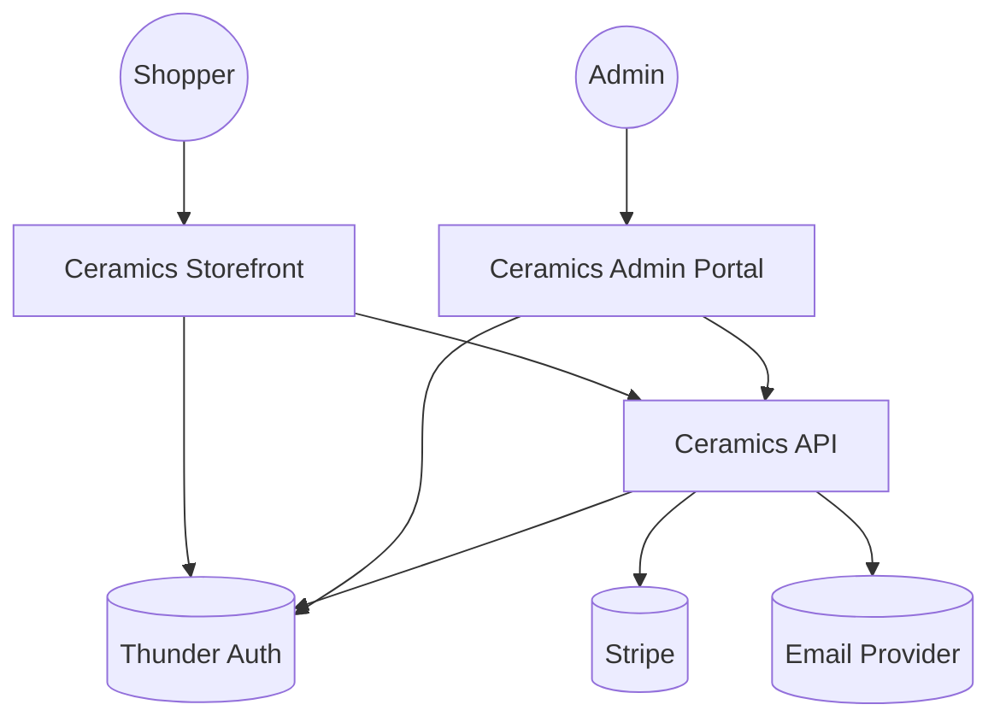
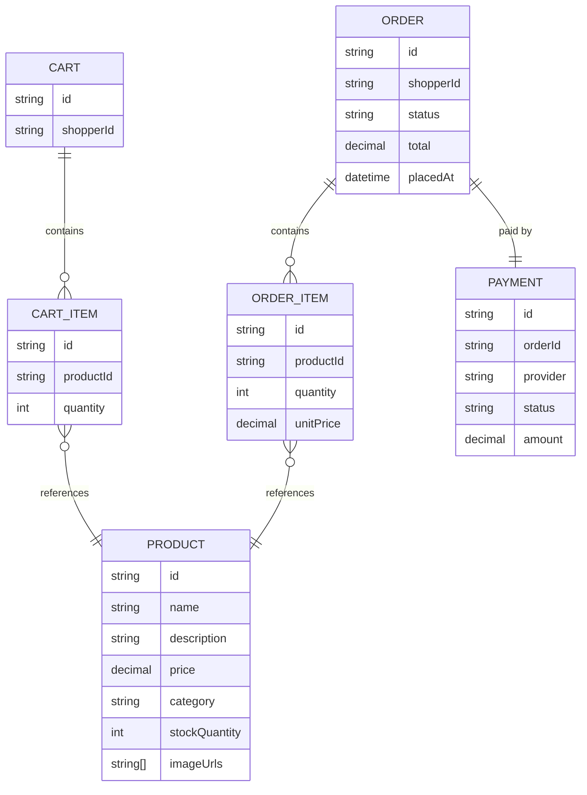
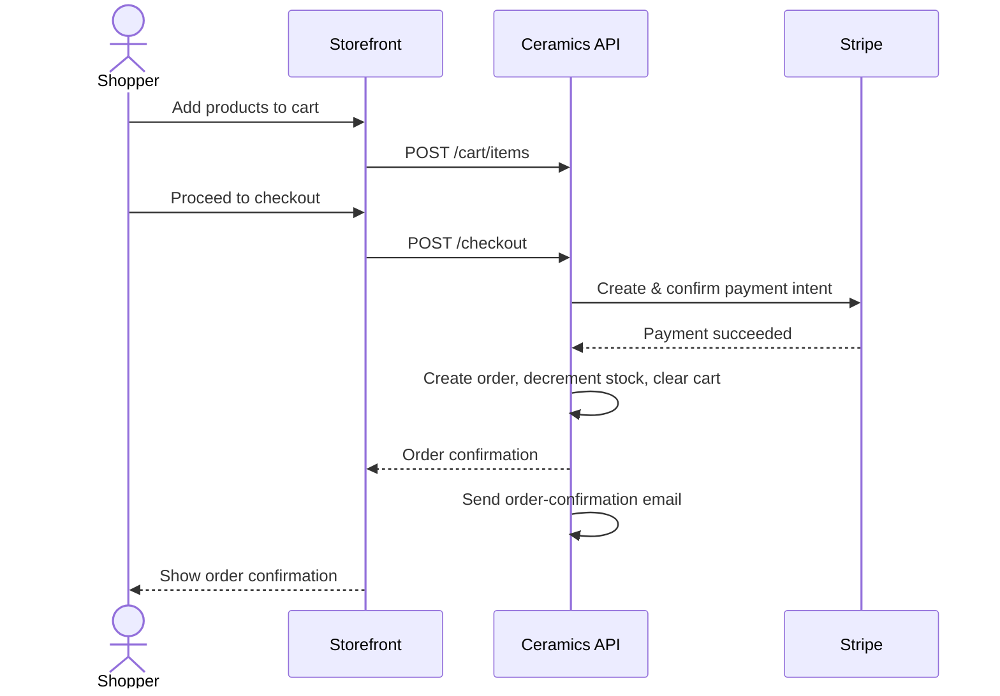
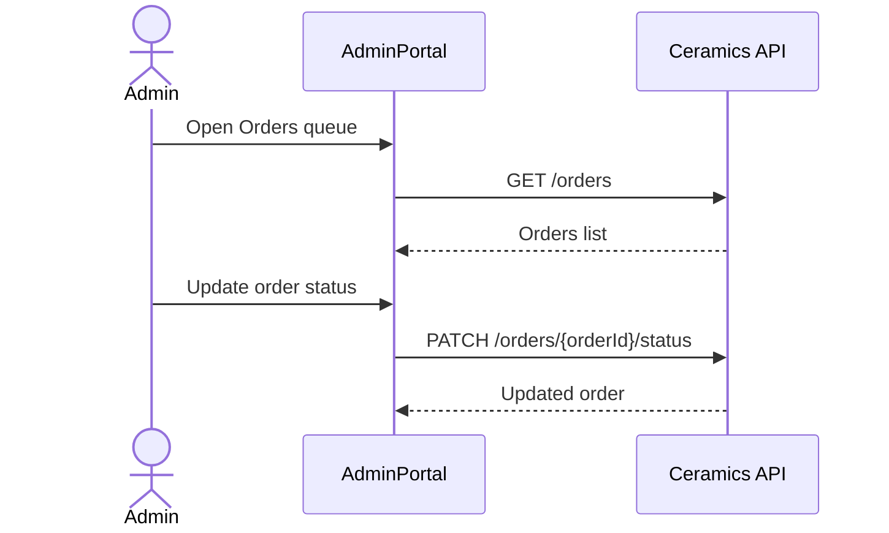

# Handmade Ceramics Online Store — Design

## Overview

A single-shop e-commerce system split into two customer-facing surfaces and one backend. Shoppers sign in via Thunder SSO and use the **Ceramics Storefront** web app to browse the catalog, manage a cart, check out with real payment processing through Stripe, and track their own orders. The store owner uses the separate **Ceramics Admin Portal** to manage products, inventory, and order fulfillment. Both web apps call the **Ceramics API**, the single backend service that owns the catalog, cart, checkout/payment orchestration, and order data, and that sends order-confirmation email on successful checkout.

## Context (C1)

## Domain model (ER)

## Key flows

### Shopper checkout

### Admin fulfills an order

